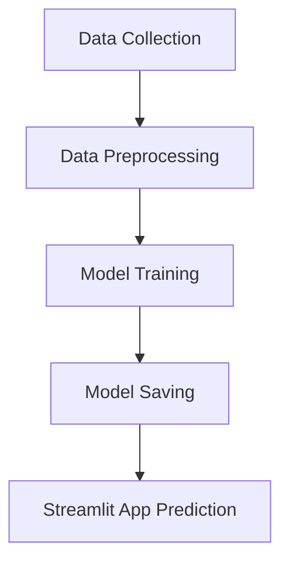

# 📊 Customer Churn Prediction

[](https://streamlit.io/) [](https://opensource.org/licenses/MIT)

Predict which customers are likely to leave a telecom service using machine learning! This project provides an end-to-end solution, from data exploration and model training to an interactive web app for real-time predictions.

---

## 🚀 Features
- **Interactive Web App**: User-friendly Streamlit interface for instant churn prediction.
- **Machine Learning Model**: Random Forest classifier trained on real customer data.
- **Data Exploration**: Jupyter notebook for in-depth analysis and visualization.
- **Easy Deployment**: Run locally with minimal setup.

---

## 🗂️ Project Structure
| File/Folder                  | Description                                      |
|-----------------------------|--------------------------------------------------|
| `churn_main.py`              | Train and save the Random Forest model           |
| `churn_app.py`               | Streamlit app for live churn prediction          |
| `customer_churn_prediction.ipynb` | Data analysis and visualization notebook   |
| `Telco_Customer_Churn.csv`   | Customer dataset                                 |
| `random_forest_model.joblib` | Saved trained model                              |

---

## 🛠️ Installation & Setup
1. **Clone the repository**
   ```bash
   git clone <repo-url>
   cd Churn_prediction
   ```
2. **Install dependencies**
   ```bash
   pip install streamlit pandas scikit-learn joblib
   ```
   Or, if you have a `requirements.txt` file:
   ```bash
   pip install -r requirements.txt
   ```

---

## 🔄 Project Workflow


---

## 💡 Usage
### 1. **Train the Model (Optional)**
If you want to retrain the model:
```bash
python churn_main.py
```
This will generate `random_forest_model.joblib`.

### 2. **Launch the Web App**
```bash
streamlit run churn_app.py
```

### 3. **Predict Churn**
- Enter customer details in the web interface.
- Instantly see if the customer is likely to churn or stay.

---

## 📊 Dataset Overview

**Source**: [Kaggle – Telco Customer Churn](https://www.kaggle.com/blastchar/telco-customer-churn)

- 7043 rows × 21 columns
- Target Variable: `Churn` (Yes/No)
- Features: Demographics (gender, age), services (Internet, Phone), contract type, tenure, charges, etc.

The dataset (`Telco_Customer_Churn.csv`) contains:
- Demographics (gender, senior citizen, etc.)
- Service details (Internet, contract type, etc.)
- Billing info (monthly/total charges)
- Churn label (Yes/No)

---

## ⚙️ Methodology

### 🔎 1. Exploratory Data Analysis (EDA)
- Handled missing values
- Visualized churn distribution, contract types, charges
- Found important correlations (e.g., contract type, monthly charges)

### 🧹 2. Data Preprocessing
- Categorical encoding (LabelEncoder)
- Feature scaling (StandardScaler)
- Feature engineering (tenure buckets, total services)

### 🧠 3. Model Building
Used multiple classifiers:
- Logistic Regression
- Random Forest ✅ *(best model used)*
- Decision Tree
- XGBoost

**Final Model**: `RandomForestClassifier` (saved as `random_forest_model.joblib`)

### 📈 4. Model Evaluation
- Accuracy: ~82%
- ROC-AUC Score: 0.85
- Confusion matrix and classification report included

---

## 📝 Example
**Sample Input:**
- Tenure: 12
- Internet Service: Fiber optic
- Contract: Month-to-month
- Monthly Charges: 80
- Total Charges: 960

**Sample Output:**
> This customer is likely to churn.

---

## 🖥️ Streamlit App

A web interface using Streamlit (`churn_app.py`) allows users to:
- Enter customer details manually
- Get churn prediction in real-time

### ▶️ To Run the App

```bash
# Step 1: Install dependencies
pip install -r requirements.txt

# Step 2: Run Streamlit app
streamlit run churn_app.py
```

---

## ⚙️ Requirements
- Python 3.7+
- streamlit
- pandas
- scikit-learn
- joblib

---

## 🤝 Contributing
Pull requests are welcome! For major changes, please open an issue first to discuss what you would like to change.

---

## 📬 Contact
For questions or suggestions, please open an issue in this repository.

---

## 🏷️ License
This project is licensed under the MIT License.
